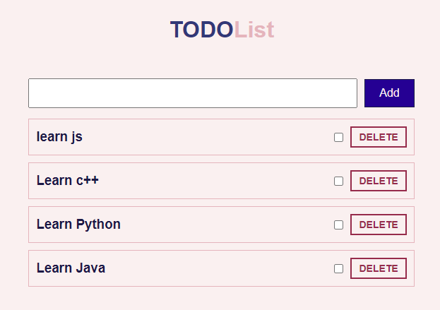

# Todo List

> A simple website where user can add, check and delete items.

## Table of contents

- [Todo List](#todo-list)
  - [Table of contents](#table-of-contents)
  - [General info](#general-info)
  - [Screenshots](#screenshots)
  - [Technologies](#technologies)
  - [Setup](#setup)
  - [Code Examples](#code-examples)
  - [Status](#status)

## General info

> CRUD operation on todo list fetched from server.

## Screenshots



## Technologies

- JavaScript
- HTML5
- CSS3
- VS Code

## Setup

Clone the repo and run npm install.

## Code Examples

```js
const deleteTodo = async (id) => {
	try {
		const res = await fetch(`http://localhost:3000/todos/${id}`, {
			method: 'DELETE',
		});
		if (!res.ok) {
			throw new Error(
				`Failed to delete todo. The response status: ${res.status}`,
			);
		}
		return await res.json();
	} catch (err) {
		console.error(err);
	}
};

export default deleteTodo;
```

## Status

Project is: _done_
